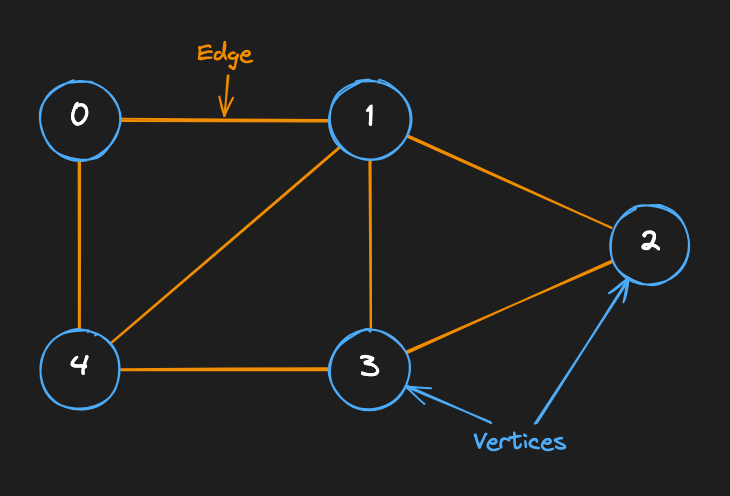

# Introduction to Graph
A graph is a set of vertices and the edges that connect those vertices. All trees are graphs, but not all graphs are trees.



For now, we'll use a matrix to represent the edges in a graph that connect each pair of vertices. For example, here's a matrix that represents the graph above.


Attempt | 0 | 1 | 2 | 3 | 4 | 
:---: | :---: | :---: | :---: |:---: |:---: 
0 | False | True | False | False | True 
1 | True | False | True | True | True 
2 | False | True | False | True | False 
3 | False | True | True | False | True 
4 | True | True | False | True | False 

In Python, we can use a list of lists to represent this matrix:
```
[
  [False, True, False, False, True],
  [True, False, True, True, True],
  [False, True, False, True, False],
  [False, True, True, False, True],
  [True, True, False, True, False]
]
```

## Assignment
LockedIn, like all social networks, has a social graph: each user is a vertex, and each "friendship" (or in corpo-speak "connection") is an edge. We want to represent this graph as a matrix. Our users each have a unique ID, which is an integer that we'll use for their vertex number.
1. Complete the `__init__` method.
    - Create a new data member called `graph`, it should be an empty list.
    - Fill the graph with `n` lists, where `n` is the number of vertices in the graph.
    - Each of these lists should contain `n` `False` values.
2. Complete the `add_edge` method.
    - It takes two vertices as inputs: `u` and `v`.
    - It adds an edge to the graph by setting the corresponding cells to `True`.
    - There are two cells in the matrix for each pair of vertices. For example, `(2, 3)` corresponds to these cells:

        Attempt | 0 | 1 | 2 | 3 | 4 | 
        :---: | :---: | :---: | :---: |:---: |:---: 
        0 |  |  |  |  |  
        1 |  |  |  |  |  
        2 |  |  |  | True |  
        3 |  |  | True |  |  
        4 |  |  |  |  |  