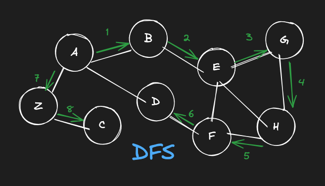

# Depth First Search (DFS)
Depth-first search (DFS) is just another algorithm to traverse a graph - kind of like breadth first search. It starts at a root node (some arbitrary node on the graph) and explores as far as possible along each branch before backtracking and starting down the next branch.

*The provided image depicting Depth First Search (DFS) is illustrative and not directly related to the specific code assignment in this lesson.*

## Assignment
The LockedIn executives want us to add a depth-first search feature to geographic search.

**Complete the `depth_first_search` and `depth_first_search_r` methods.**\
The `depth_first_search_r` method is a [recursive](https://www.cs.utah.edu/~germain/PPS/Topics/recursion.html) helper method for `depth_first_search`.

1. Complete the `depth_first_search` function. It takes a start vertex as input, traverses the graph in a depth-first manner, records the vertices it visits in a list, and returns it. It should:
    1. Create an empty list to store visited vertices.
    2. Call `depth_first_search_r` with the empty list and the start vertex
    3. Return the list of visited vertices after `depth_first_search_r` has filled it in
2. Complete the `depth_first_search_r` function. It takes a list of vertices that have been visited so far and a current vertex as input. It should:
    1. Visit the current vertex by adding it to the list
    2. Get a [sorted](https://docs.python.org/3/library/functions.html#sorted) list of the neighbors of the current vertex
    3. For each of those neighbors:
        - If the neighboring vertex hasn't been visited yet, visit it by recursively calling `depth_first_search_r` with the neighboring vertex